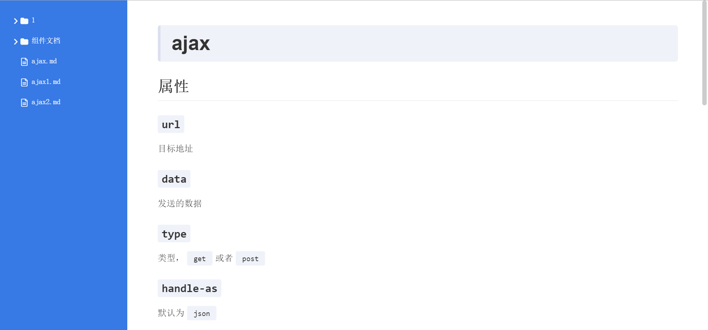

# md2docs

!!!WIP!!!

generate static docs site from markdown files

## Usage

```bash
# config root path
$ md2docs -r ./path/to/docs

# use your own color theme
$ md2docs -c #DDD

# specify a port
# md2docs -p 8080
```

## screenshot


